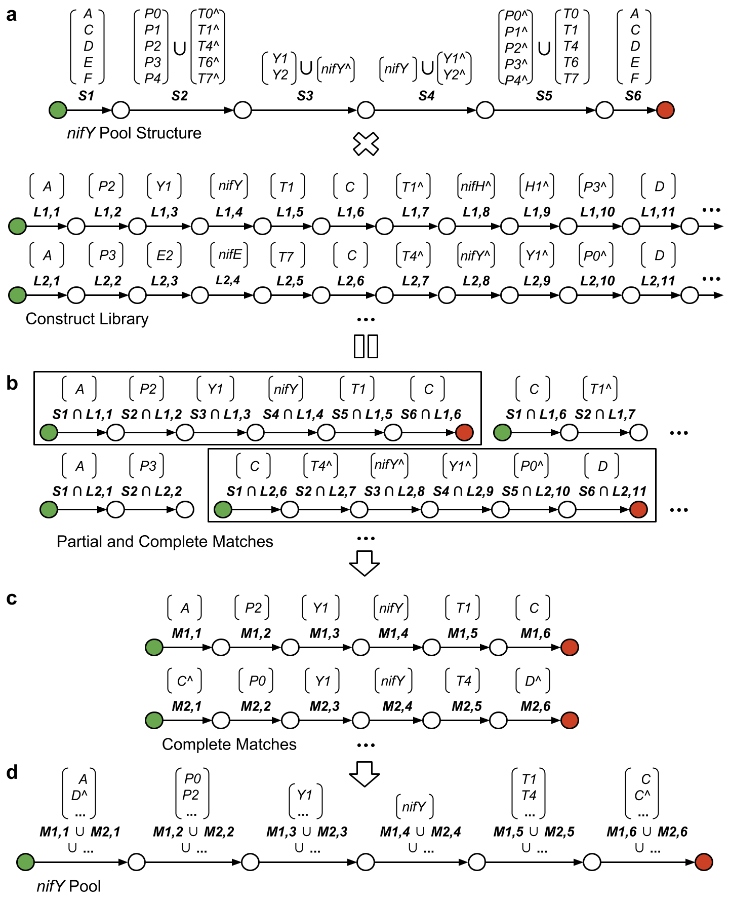

= PoolDesigner - Designing Multiplexed Pools for Assembling Library Constructs

== Quickstart

. Clone this project from GitHub.
. http://neo4j.com/download[Download, install, and start a Neo4j server.].
. Open the Neo4j web interface in your browser at http://localhost:7474.
. Configure "*kn0x*" as the Neo4j password.
. https://maven.apache.org/download.cgi[Download and install Maven.]
. Build and run this project from the command line with `mvn spring-boot:run`.
. Open the Pool Designer web interface in your browser at http://localhost:8080.
. Quick demo: 
. Click Choose Files and select nif_library.xml from the directory poolDesigner/src/main/resources/static/sbol/.
. Click Import SBOL to load the construct library into Neo4j.
. Click New Structure to create a new pool structure and change 'CDS' to 'nifY'.
. Click Extract Pools to automatically design a new pool based on your structure.

== Overview of Pool Design Method

The first step *(a)* in the pool design method is to represent the specified pool structure and construct library as linear directed acyclic graphs (DAGs). In this method, each edge in a DAG is labeled with a set of IDs for one or more genetic parts. Each path through a DAG from a green start node to a red stop node then represents one or more genetic constructs, each obtained by concatenating a single part identified on each edge in the path. Since the edges of a library DAG belong to a single path and are each labeled with a single part ID, each library DAG encodes a single construct. The edges of the specification DAG, on the other hand, are each labeled with multiple IDs of parts known to occur in the construct library. In this case, the specification DAG encodes all possible nifY transcriptional units (forward and reverse complement in orientation) that might occur in the construct library. Note that some IDs end with the character ‘^’ to indicate that the identified part occurs on the reverse complement strand.

The second step *(b)* is to take a tensor product of the specification DAG with the library DAGs. Briefly, this product produces a new set of DAGs in which each node corresponds to a combination of two nodes, one from the specification DAG and one from a library DAG. Each node a new DAG produced in this way is labeled with the union of the start/stop labels on the corresponding nodes in the original DAGs. Edges are then created between nodes in the new DAGs provided that edges exist between their corresponding nodes in the original DAGs and that the intersection of the IDs labeling these edges is non-empty (each edge is labeled with this intersection). The requirement for a non-empty intersection of labels is particular to this method.

The third step *(c)* is to determine which portions of the product DAGs correspond to complete matches (boxes) to the specification DAG. This is done by traversing the DAGs from each green start node and returning those paths that end with a red stop node. In addition, if such a path contains an edge that is labeled with an ID ending in ‘^’, then the labels of its start and stop nodes are swapped, the directions of its edges are reversed, and the IDs labeling each edge are processed as follows: if an ID does not end with ‘^’, then ‘^’ is concatenated to the end of that ID; otherwise, ‘^’ is removed from that ID. 

The final step *(d)* is to merge the DAGs for the complete matches into a single DAG that encodes the pool extracted from the construct library. Since each match DAG has a single path of the same length, the pool DAG can be obtained by constructing a linear DAG of this length and labeling each of its edges with the union of the IDs labeling the corresponding edges in the match DAGs.

== License

Pool Designer is licensed under a BSD 3-Clause License.

Copyright (c) 2016, Nicholas Roehner
All rights reserved.

Redistribution and use in source and binary forms, with or without modification, are permitted provided 
that the following conditions are met:

1. Redistributions of source code must retain the above copyright notice, this list of conditions and 
the following disclaimer.

2. Redistributions in binary form must reproduce the above copyright notice, this list of conditions 
and the following disclaimer in the documentation and/or other materials provided with the distribution.

3. Neither the name of the copyright holder nor the names of its contributors may be used to endorse 
or promote products derived from this software without specific prior written permission.

THIS SOFTWARE IS PROVIDED BY THE COPYRIGHT HOLDERS AND CONTRIBUTORS "AS IS" AND ANY EXPRESS OR IMPLIED 
WARRANTIES, INCLUDING, BUT NOT LIMITED TO, THE IMPLIED WARRANTIES OF MERCHANTABILITY AND FITNESS FOR A 
PARTICULAR PURPOSE ARE DISCLAIMED. IN NO EVENT SHALL THE COPYRIGHT HOLDER OR CONTRIBUTORS BE LIABLE FOR 
ANY DIRECT, INDIRECT, INCIDENTAL, SPECIAL, EXEMPLARY, OR CONSEQUENTIAL DAMAGES (INCLUDING, BUT NOT LIMITED 
TO, PROCUREMENT OF SUBSTITUTE GOODS OR SERVICES; LOSS OF USE, DATA, OR PROFITS; OR BUSINESS INTERRUPTION) 
HOWEVER CAUSED AND ON ANY THEORY OF LIABILITY, WHETHER IN CONTRACT, STRICT LIABILITY, OR TORT (INCLUDING 
NEGLIGENCE OR OTHERWISE) ARISING IN ANY WAY OUT OF THE USE OF THIS SOFTWARE, EVEN IF ADVISED OF 
THE POSSIBILITY OF SUCH DAMAGE.
